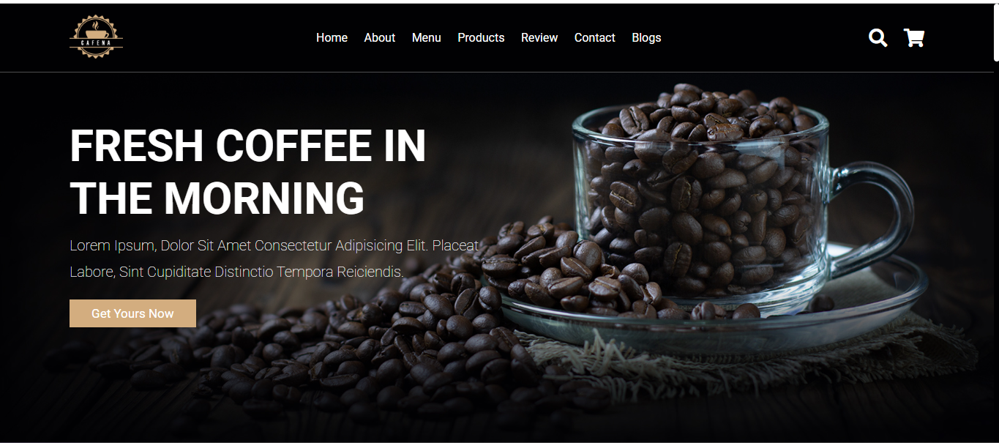
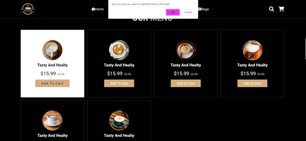
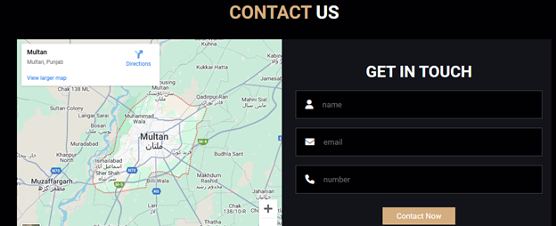

# ☕ Cafena Coffee Shop Website

A modern, responsive coffee shop website design built with HTML, CSS, and JavaScript.

**Main Page:**

**Error Prevention**

**Match Between System & Real World**

## 🚀 Features
- 🍵 **Responsive Design** – Fully functional across all devices.
- 🛒 **E-Commerce Ready** – Shopping cart functionality.
- ⭐ **User Reviews** – Integrated customer feedback section.
- 📖 **Blog Section** – Updates and articles about coffee.
- 🗺️ **Google Maps Integration** – Find our shop easily.

## 📂 Project Structure
cafena-coffee-shop/
│── assets/                   # All static assets
│   ├── images/               # Images used in the project
│   ├── fonts/                # Custom fonts (if any)
│   ├── icons/                # Icon files (if used separately)
│── css/                      # Stylesheets
│   ├── style.css             # Main CSS file
│   ├── responsive.css        # Additional responsive styles (if any)
│── js/                       # JavaScript files
│   ├── script.js             # Main JavaScript file
│   ├── cart.js               # Shopping cart functionality (if applicable)
│── pages/                    # Additional pages (if any)
│   ├── about.html            # About page
│   ├── menu.html             # Menu page
│   ├── contact.html          # Contact page
│── index.html                # Main homepage file
│── .gitignore                # Git ignore file
│── README.md                 # Project documentation
│── LICENSE                   # License file (if applicable)
│── CONTRIBUTING.md           # Contribution guidelines (if open-source)
